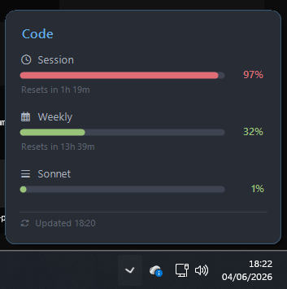
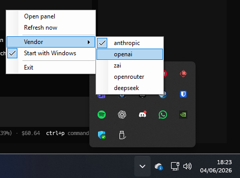

# Desktop integrations — GNOME · macOS · Windows

ai-usagebar ships a fast Rust backend (`ai-usagebar` / `ai-usagebar.exe`) plus
three **native desktop UIs**. They all do the same thing: run the backend,
read its `--json`, and show the **5-hour (session)** and **weekly** usage bars
next to your clock — with a dropdown for the full breakdown (Session / Weekly /
Sonnet / Extra usage).

| Platform | UI | Directory |
|---|---|---|
| **Linux (GNOME)** | Shell extension (top panel) | [`gnome-extension/`](gnome-extension/) |
| **macOS** | Menu bar app (`NSStatusItem`) | [`macos/`](macos/) |
| **Windows** | System-tray app (WinForms) | [`windows-tray/`](windows-tray/) |

> 🙌 **Credit:** the **Windows tray** was created by
> **[EaeDave](https://github.com/EaeDave/ai-usagebar)** and is vendored here
> (MIT) with credit — upstream authorship for Windows is his. The GNOME and
> macOS UIs are this fork's.

All three are **thin consumers** of the backend's JSON — no vendor/auth logic
is reimplemented; that all stays in the audited Rust binary. (Linux/Wayland
users can also use the upstream **Waybar** widget directly — see the
[main README](README.md).)

---

## 0. Clone + authenticate (all platforms)

```bash
git clone https://github.com/samirhvbr/ai-usagebar.git
cd ai-usagebar
```

Log in once to the vendor you'll display. For Anthropic, run the Claude Code
CLI — it writes the OAuth file the backend reads:

- **Linux/Windows:** `claude` → `~/.claude/.credentials.json`
  (`%USERPROFILE%\.claude\.credentials.json` on Windows)
- **macOS:** `claude` → stored in the login **Keychain** (read automatically)

Other vendors (OpenAI/Z.AI/OpenRouter/DeepSeek) and the in-app **Vendors** login
helper are covered in the [main README](README.md#authentication) and the
GNOME prefs.

---

## 1. Linux — GNOME Shell extension

```bash
cargo install ai-usagebar              # or the AUR (yay -S ai-usagebar-bin); builds the backend
cd gnome-extension
./install.sh                           # symlink into ~/.local/share + compile the GSettings schema
# Reload GNOME Shell: LOG OUT / IN     (do NOT `gnome-shell --replace` — it can crash the session)
gnome-extensions enable ai-usagebar@akitaonrails.github.io
gnome-extensions prefs  ai-usagebar@akitaonrails.github.io   # bars, colors, percent-only, Vendors login
```

Bars appear in the top panel next to the clock/network. Full details (the
Preferences window, the **Vendors** login/config tab):
[`gnome-extension/README.md`](gnome-extension/README.md).

## 2. macOS — menu bar app

```bash
cargo install ai-usagebar              # builds the backend into ~/.cargo/bin
cd macos
./build.sh                             # swiftc -O -> ./ai-usagebar-menubar  (no Xcode project)
./ai-usagebar-menubar &                # appears in the menu bar (no Dock icon)
./install-agent.sh                     # (optional) start at login via LaunchAgent
```

Open **Preferences** with **⌘,** for bars / per-severity colors / vendor /
interval. The menu bar works on macOS 10.15+; the Preferences window needs
macOS 12+. Step-by-step: [`macos/INSTALL.md`](macos/INSTALL.md).

## 3. Windows — system-tray app

Needs the **Rust toolchain** + **.NET 8 SDK**
(`winget install Rustlang.Rustup` and `winget install Microsoft.DotNet.SDK.8`).

```powershell
cargo build --release                  # -> target\release\ai-usagebar.exe
cd windows-tray
dotnet build -c Debug                  # framework-dependent (fast; uses the installed runtime)
start "" "bin\Debug\net8.0-windows\ai-usagebar-tray.exe"
```

Look for the colored dot in the **system tray** (click the `^` to show hidden
icons): left-click → panel, right-click → menu (Refresh, **Vendor picker**,
Start with Windows, …). Step-by-step + the real-world build gotchas we hit:
[`windows-tray/TESTING.md`](windows-tray/TESTING.md). For a portable,
self-contained bundle (no .NET install needed to run): `dotnet publish -c Release`.

---

## What it looks like

**Windows tray** — by [EaeDave](https://github.com/EaeDave/ai-usagebar):





*(GNOME and macOS look the same in spirit — colored bars next to the clock and
a per-window dropdown.)*
