# ai-usagebar

Native Omarchy Quattro panel, Waybar widget, and tabbed TUI for AI plan usage across **Claude**, **Codex/ChatGPT**, **GitHub Copilot**, **Z.AI (GLM)**, **OpenRouter**, **DeepSeek**, **DeepInfra**, **Kimi**, **Nous Research**, **OpenCode Go**, **Command Code**, **Devin**, and other supported AI coding services.

ai-usagebar began as a Rust port of
[`claudebar`](https://github.com/mryll/claudebar) and remains drop-in
compatible. It keeps claudebar's Pango tooltip, Omarchy theme detection, and
flock-protected OAuth refresh while adding more providers and a testable Rust
codebase.

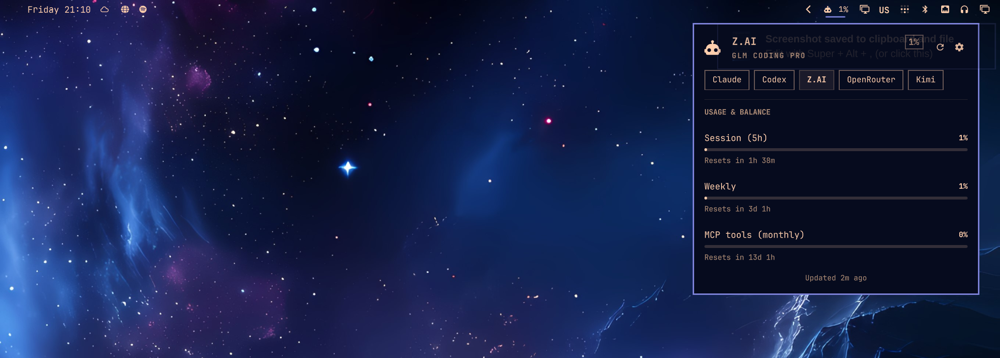

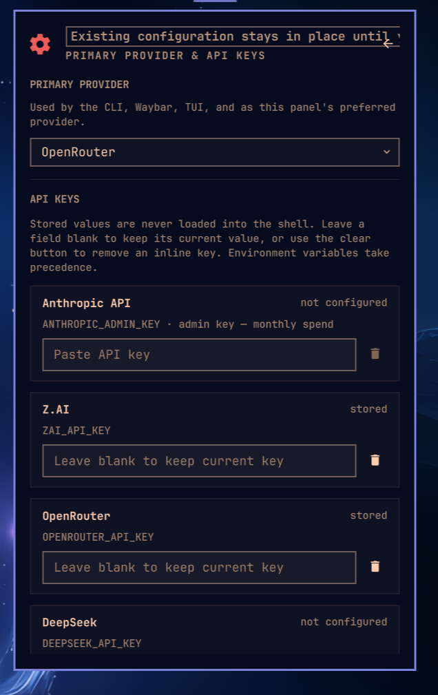

## Features

- Per-provider Waybar modules use the same JSON shape and flags as claudebar.
- The native Omarchy Quattro plugin follows the shell theme and supports
  keyboard navigation, provider switching, live reset timers, and stale/error
  states.
- `ai-usagebar-tui` opens with a compact provider overview and refreshes every
  60 seconds. Its navigation can use a sidebar, navbar, or no vendor box.
- An optional Claude Code context view reads recent local session usage without
  scanning entire histories.
- Native integrations are available for Omarchy, GNOME Shell, KDE Plasma 6,
  and a macOS/Windows system-tray popover (`ai-usagebar-tray`). An experimental
  GTK tray frontend for Linux Mint is in [`linux-mint/`](linux-mint/README.md).
- One bar item can cycle through enabled providers. `[ui] primary` controls the
  initial provider in both the widget and TUI.
- Atomic caches and file locking prevent duplicate requests from multi-monitor
  Waybar setups.
- Quota-threshold desktop notifications are on by default: a window crossing
  97% (configurable in `[notifications]` or macOS Preferences) raises one
  system alert per crossing on Linux and macOS. At 100% the limit is critical,
  and banked Codex/SuperGrok
  reset credits warn 48h before expiring. Set `enabled = false` under
  `[notifications]` to turn them off — see the
  [configuration reference](docs/configuration.md#notifications).
- Network failures keep the previous data visible; HTTP errors appear in the
  tooltip.
- A vendor that answers HTTP 429 is left alone for five minutes: the last good
  snapshot keeps showing marked as stale, or the entry reads "rate limited; next attempt in 4m"
  and no request is made until then (every vendor on the shared cache; Nous
  Research has its own path).
- `--pretty`, `--watch N`, and `make smoke` help with local testing and API
  response changes.

## Reference guides

- [Configuration](docs/configuration.md)
- [Development guide](DEVELOPMENT.md)
- [TUI mouse support](docs/tui-mouse-support.md)
- [Windows build guide](docs/windows-build.md)
- [Ollama Cloud integration](docs/ollama-setup.md)
- [Claude accounts](docs/claude-accounts.md)
- [Format placeholders](docs/format-placeholders.md)
- [Provider endpoints and live tests](docs/vendor-endpoints.md)
- [KDE Plasma 6 plasmoid](kde-plasmoid/README.md)

## Install

### Nix

Run either application directly from GitHub:

```bash
nix run github:akitaonrails/ai-usagebar
nix run github:akitaonrails/ai-usagebar#tui
```

Install both `ai-usagebar` and `ai-usagebar-tui` into your user profile:

```bash
nix profile install github:akitaonrails/ai-usagebar
```

For a flake-based NixOS or Home Manager configuration, add the input in your
root `flake.nix`:

```nix
inputs.ai-usagebar.url = "github:akitaonrails/ai-usagebar";
```

Pass `inputs` to your NixOS modules with `specialArgs`:

```nix
nixpkgs.lib.nixosSystem {
  system = "x86_64-linux";
  specialArgs = { inherit inputs; };
  modules = [ ./configuration.nix ];
}
```

For standalone Home Manager, use `extraSpecialArgs`:

```nix
let
  system = "x86_64-linux";
in
home-manager.lib.homeManagerConfiguration {
  pkgs = nixpkgs.legacyPackages.${system};
  extraSpecialArgs = { inherit inputs; };
  modules = [ ./home.nix ];
}
```

If your configuration already passes `inputs` through these arguments, you do
not need to add it again. Then consume the package in a NixOS module:

```nix
{ inputs, pkgs, ... }:
{
  environment.systemPackages = [
    inputs.ai-usagebar.packages.${pkgs.stdenv.hostPlatform.system}.default
  ];
}
```

The equivalent Home Manager module is:

```nix
{ inputs, pkgs, ... }:
{
  home.packages = [
    inputs.ai-usagebar.packages.${pkgs.stdenv.hostPlatform.system}.default
  ];
}
```

Alternatively, apply the overlay when you want the package available as
`pkgs.ai-usagebar`:

```nix
{ inputs, pkgs, ... }:
{
  nixpkgs.overlays = [ inputs.ai-usagebar.overlays.default ];
  environment.systemPackages = [ pkgs.ai-usagebar ];
}
```

### Omarchy Quattro

The native plugin is a display frontend and does not bundle the
`ai-usagebar` executable. Both are needed, and they install through different
managers — the binary is a system package, the plugin is per-user shell config
under `~/.config/omarchy/plugins/` — so this is one paste rather than one
command:

```bash
omarchy pkg aur add ai-usagebar-bin &&
  omarchy plugin add https://github.com/akitaonrails/ai-usagebar.git --enable
```

If you found the plugin through [plugins.omarchy.org](https://plugins.omarchy.org/plugin.html?id=akitaonrails.ai-usagebar),
its **Install** button copies the `omarchy plugin add` line on its own. That
installs the widget but not the binary it reads, and the bar will say
`ai-usagebar is not installed` until you run the `omarchy pkg aur add` half too.

Quattro enables its own `omarchy.agents` status widget by default. Disable it
if you want AI Usage to be the only agent status item in the bar:

```bash
omarchy plugin disable omarchy.agents
```

Once enabled, **left-click the AI Usage widget** to open the native Quattro
usage panel. From that panel, click the **gear** or press `s` to open the native
QML settings page. **Right-click intentionally opens `ai-usagebar-tui` in a
terminal**; it is not the settings shortcut. Middle-click or use the mouse
wheel to switch providers. In QML settings, turn off **Show usage value in the
top bar** for an icon-only widget; the panel and tooltip keep the full details.
Turn on **Show provider name in the top bar** to prefix the entry with the same
three-letter code Waybar's `{vendor_short}` prints, so a bar cycling several
providers says which one it is showing. Use **Top bar usage window** to pin the
bar to one quota window — auto (highest), 5-hour, weekly, or monthly — instead
of always showing the highest percent; the tooltip and panel hero echo the
pinned value while panel rows list every window. **Show usage as** reads
percentages as what is used (the default) or what is left of the same window.
**Show provider logos** draws each provider's own mark; turn it off for the
generic robot icon. The **Metrics** section expands per provider and switches
each metric on or off; a switched-off metric disappears from the panel, the bar
and the tooltip, and is left out of the highest percent that sets the bar value
and the alert state, which follows the used share in either reading. The
settings page is an accordion: one section open at a time, the first open by
default.

The source-built `ai-usagebar` AUR package can replace `ai-usagebar-bin` in
the first command.

### Arch (AUR)

Two packages. Pick one:

```bash
yay -S ai-usagebar-bin    # prebuilt binary from GitHub Releases (fast, ~5s install)
yay -S ai-usagebar        # compiles from source (~30-60s, hermetic)
```

The `-bin` variant downloads the same x86_64 ELF that CI built and tested. The source variant compiles locally with your toolchain. Both install identical binaries to `/usr/bin/`. If you already have one installed, switch with `yay -S` the other package; pacman handles the swap through `conflicts`/`provides`.

### Other Linux / macOS (crates.io)

```bash
cargo install ai-usagebar                # compile from source (needs rustup)
cargo binstall ai-usagebar               # download prebuilt binary (needs cargo-binstall, no rustup)
```

`cargo binstall` fetches the same x86_64 / aarch64 Linux tarball the AUR `-bin` package uses. Both install `ai-usagebar` + `ai-usagebar-tui` to `~/.cargo/bin/`.

### From source

```bash
cargo build --release
sudo make install                  # → /usr/local/bin
# or
make install PREFIX=$HOME/.local   # → ~/.local/bin
```

### Windows

The **Waybar widget is Wayland-only and does not apply to Windows.** Use the
**system-tray popover** (`ai-usagebar-tray`) or **`ai-usagebar-tui`**. The tray
reads the same `usage --json` report as the KDE plasmoid, in-process — no
console window. `ai-usagebar --json` / `--pretty` still work for scripting.

Install with [Scoop](https://scoop.sh) from the official bucket:

```powershell
scoop bucket add akitaonrails https://github.com/akitaonrails/scoop-bucket
scoop install ai-usagebar
```

Scoop-installed trays update themselves through Scoop: **Install Update** (and
**Automatic**) runs `scoop update ai-usagebar`, then the tray quits while Scoop
replaces it — usually 10–60 seconds — and relaunches from Scoop's `current`
path. The Scoop transcript is written to
`%LOCALAPPDATA%\ai-usagebar\updates\scoop.log`; if Scoop does not deliver the
requested version, the tray reports that log path and Automatic does not retry
it in the background. A global Scoop install without the `scoop.ps1` shim
keeps the release-page fallback. The tray's built-in updater applies to
standalone ZIP installs.


Build with a standard Rust toolchain plus **Node.js 20+** (the tray WebView is
a Vite app; `build.rs` runs `npm run build` on Windows). WebView2 Evergreen
ships with Windows 11 and recent Windows 10:

```powershell
cargo build --release
# binaries: target\release\ai-usagebar.exe, ai-usagebar-tui.exe, ai-usagebar-tray.exe
.\target\release\ai-usagebar-tray.exe
```

Pin the icon in the Windows 11 notification overflow if it hides behind the
chevron. Left-click opens the popover; right-click opens the same menu as
the popover's Options — Customize (Classic only), Settings, Refresh, Detect
Providers, Open TUI, Start at Login, Check for Updates, About, and Quit — in
the popover's language. On its first run the
tray detects which vendors already have a credential on this PC (local files
and keys only, never the network) and enables eligible vendors in
`config.toml` — it never turns a vendor off. Opt-in-only providers such as
Devin are never activated by automatic detection, including **Detect Providers**;
enable Devin explicitly in Settings or with `[devin] enabled = true`. Settings
adds a global shortcut that toggles the popover from anywhere, the poll interval,
and an update mode
(Automatic / Notify me / Off) that installs new releases from GitHub after
verifying their `.sha256`; all three live in the `[tray]` section of
`config.toml` (`shortcut`, `refresh_minutes` = 1, 5 or 10; default 5;
`updates`). See [windows/README.md](windows/README.md).


Credentials are read from the Windows user profile rather than `$HOME`:
`%USERPROFILE%\.claude\.credentials.json` (Anthropic) and
`%USERPROFILE%\.codex\auth.json` (OpenAI Codex). Run the official `claude` /
`codex` CLI once on Windows to populate them, exactly as on Linux/macOS.
API-key vendors work unchanged via environment variables or `config.toml`.

## Authentication

Claude and Codex reuse OAuth credentials from their official CLIs. Other
providers use API keys, an existing app login, or a local service. API keys can
come from environment variables or `config.toml`.

| Vendor | Method | Action required |
|---|---|---|
| Claude | OAuth from `~/.claude/.credentials.json` or the macOS login Keychain | Run `claude` once. Tokens refresh automatically. |
| Anthropic API | Organization Admin key | Opt in with `ANTHROPIC_ADMIN_KEY` or `[anthropic_api] api_key`. Inference and Claude Code keys do not work. |
| Codex | OAuth, read from `~/.codex/auth.json` | Run `codex login` once. Token auto-refreshes. |
| GitHub Copilot | GitHub CLI OAuth | Run `gh auth login --web`, then choose GitHub Copilot as the primary provider in Settings. ai-usagebar gets the token only with `gh auth token`; `GITHUB_COPILOT_TOKEN` is an optional explicit override. |
| Z.AI | API key (`ZAI_API_KEY` env or `[zai] api_key` in config) | Set either. |
| OpenRouter | API key (`OPENROUTER_API_KEY` env or `[openrouter] api_key` in config) | Set either. Multiple keys: one `[[openrouter.accounts]]` entry each. |
| DeepSeek | API key (`DEEPSEEK_API_KEY` or config) | Set either and opt in. |
| DeepInfra | API key (`DEEPINFRA_API_KEY` or config) | Set either and opt in. Reports prepaid balance and current-month spend. |
| Kimi | Existing Kimi Code CLI login **or** API key (`KIMI_API_KEY` or config) | Opt in, then either log in with `kimi` (nothing to paste) or set an API key, which wins when present. A Kimi For Coding subscription can issue one at kimi.com/code/console. |
| Kilo | API key (`KILO_API_KEY` env or `[kilo] api_key` in config) | Set either. Opt-in. For a team balance, also set `[kilo] organization_id`; omit it for the personal balance. |
| Novita | API key (`NOVITA_API_KEY` env or `[novita] api_key` in config) | Set either. Opt-in. |
| Lyceum | API key (`LYCEUM_API_KEY` env or `[lyceum] api_key` in config) | Opt-in. Reports the available USD balance and amount used; no percentage quota or reset is inferred. |
| OrcaRouter | API key (`ORCAROUTER_API_KEY` env or `[orcarouter] api_key` in config) | Set either. Opt-in. Reports the credit card (spend / total limit / remaining, key expiry) from the one-api compatible dashboard billing endpoints. |
| Moonshot | API key (`MOONSHOT_API_KEY` or config) | Opt in. Set region `cn` for CNY; `global` uses USD. |
| Grok (xAI) | Management key | Opt in with `XAI_MANAGEMENT_KEY` or config. An inference key does not work. |
| SuperGrok | Existing `grok login` (its `auth.json` key, or its ACP extension) | Opt in, install Grok Build, and run `grok login`. This reports subscription usage — overall included credits plus per-product slices (Build, Chat, Imagine) — not the Management API balance. |
| Grok Bot | Existing Grok Bot desktop sign-in (Linux and macOS) | Opt in, install the Grok Bot desktop app, and sign in to it once. This reports the app's weekly included-usage pool — not the Management API balance, and not the Grok Build subscription. Refreshed tokens stay in ai-usagebar's cache; the app's own file is never written. |
| MiniMax | Token Plan subscription key | Opt in with `MINIMAX_API_KEY` or config. Choose the matching global or China region; pay-as-you-go keys do not work. |
| Google Antigravity | Local Antigravity server, saved Google session, or `agy` status line | Opt in. The desktop products provide quota through their local server. The `agy` CLI can provide its live session quotas through the macOS status-line integration (see [Multiple Antigravity CLI accounts](#multiple-antigravity-cli-accounts-macos)); the existing saved-session Cloud Code API fallback remains available and is labelled `Google API` in the TUI. |
| Cursor | Existing Cursor IDE or `cursor-agent` login | Opt in and sign in once. `cursor-agent` is the headless fallback. |
| Kiro CLI | Existing kiro-cli login | Opt in and run `kiro-cli login` once. ai-usagebar refreshes the session when needed. |
| Nous Research | OAuth device flow | Enable `[nous]`, click **Log in with Nous Research** in the Omarchy settings panel, or run `ai-usagebar auth nous login`. Credentials are kept in ai-usagebar's separate platform config directory (`~/.config/ai-usagebar/credentials.json` on Linux). |
| OpenCode Go | API key (`OPENCODE_GO_API_KEY` env or `[opencode-go] api_key` in config) | Enable `[opencode-go]`, then enter the key in the Omarchy settings panel or set the environment variable. |
| Command Code | Existing `commandcode` or pi login | Enable `[commandcode]` and sign in to either one once. No key to paste; `COMMANDCODE_API_KEY` overrides if you prefer one. |
| Model Studio | Existing `bl auth login --console` (Alibaba Cloud) | Opt in (`[modelstudio]`), install the official `bl` CLI, and run `bl auth login --console` once. Reports the Token Plan's 5-hour and weekly percentage windows with resets, through the same console gateway the CLI uses; the credential file `~/.bailian/config.json` is only ever read. |
| Devin | Existing official Devin CLI login | Opt in (`[devin]`) after signing in with the Devin CLI. Reuses its existing `credentials.toml` read-only; ai-usagebar never logs in, refreshes, or writes credentials. Reports daily and weekly quota usage and an optional overage balance. |

### Nous credits and OpenCode Go

Nous usage percentage is calculated from the subscription-credit pool only:
`(monthly subscription credits - subscription credits remaining) / monthly subscription credits`.
Top-up/purchased credits are not mixed into that percentage. When the Portal
reports them, the tooltip and TUI show subscription credits, top-up credits, and
total usable credits as separate values. `[nous] headline = "amount"` puts those
credits still usable on the bar instead of the percentage, the way the
prepaid-balance vendors do; the percentage keeps the meter, the severity colour
and the detail line. The default is `"percent"`.

Nous login is interactive because the device code is authorized in the browser.
Leave the terminal open until it reports that login completed, then refresh the
Omarchy panel. The login never reads Hermes Agent credentials. On Unix, newly
created credential directories use mode `0700`, and credential and lock files
use mode `0600`; an existing current-user-owned config directory also works when
it is not group- or world-writable. Windows uses the user's platform config
directory and inherited per-user access controls.

OpenCode Go uses the official usage endpoint and the `percent` field. Its key can
be entered through the native Settings panel; stored values are sent to the Rust
settings command over stdin and are never placed in QML command arguments. Cache
entries are tied to the endpoint and a one-way key fingerprint, so changing
accounts cannot reuse another account's fresh or stale usage.

### Command Code

Command Code meters spend rather than tokens, so its two rolling windows are
priced in dollars: `$1.23 of $14.00` for the 5-hour window and `$5.24 of $35.00`
for the weekly one. The monthly credit allowance renders as a third window with
the derived spend against the plan's pool and a reset countdown from the
subscription's billing period end.

**There is no key to enter, and no key field in the settings panel.**
Command Code appears in the provider selector but not in the key list, the same
way Claude, Codex, Cursor and Kiro do. It is disabled by default; a local login
can auto-enable it, or you can set `enabled = true` under `[commandcode]`.
If it appeared without a login after an earlier version, set `enabled = false`
under `[commandcode]` to hide it.

Credentials are reused, never issued. The OAuth token comes from
`~/.commandcode/auth.json` from the official CLI first, then
`~/.pi/agent/auth.json`; `COMMANDCODE_API_KEY` outranks both. **The token is
only ever read.**
Refreshing it belongs to the CLI that owns the file, and writing back from here
would race the harnesses that share it; an expired token is reported as expired
instead. Set `[commandcode] auth_paths` to search somewhere else entirely.

The plan's monthly allowance is not reported by the API, so a small table maps
the plan id to it (GOAT → $70, and so on). An unrecognised plan keeps its id
and simply omits the "spent of allowance" line rather than inventing a
denominator. Cache entries are tied to the endpoint and a one-way token
fingerprint, so changing accounts cannot reuse another account's usage.

#### Grok: team-scoped vs organization-scoped keys

The balance lives at `/v1/billing/teams/{team}/prepaid/balance`, so a team has to
be identified. With a **team-scoped** management key the team is read
automatically from the key. An **organization-scoped** key cannot provide it
because that key's `scopeId` is an organization id rather than a team. Set the
team explicitly in that case:

```toml
[grok]
team_id = "your-team-id"
```

Without it, an organization-scoped key reports an error saying exactly this
rather than silently querying the wrong URL.

#### Giving a prepaid balance a tank

DeepSeek, DeepInfra, Kilo, Novita, Moonshot and prepaid Grok report money **left** and no
denominator, so their row is a plain balance rather than a meter. Tell them how
big the tank is and it becomes one:

```toml
[deepseek]
display_limit = 200        # in the currency that vendor already reports
headline = "percent"       # "amount" (default here) puts the money on the bar
```

The percentage is consumed — `(display_limit - balance) / display_limit`,
clamped to 0–100 — and whichever number is not the headline stays in the detail
line. There is no default limit: without one nothing changes. A vendor that
states its own limit keeps it, which is why `[openrouter]` has no
`display_limit` — it reports credits purchased against credits used. It does
take `headline`. Full rules in
[docs/configuration.md](docs/configuration.md#balance-tanks).

### Enabling a vendor

`enabled = true` is what makes a vendor fetch. Anthropic API, GitHub Copilot,
DeepSeek, DeepInfra, Kimi, Kilo, Novita, Moonshot, Grok, SuperGrok, Grok Bot, Antigravity,
Cursor, MiniMax, Kiro CLI, and ShvIA all default to **disabled** so that
existing installs are unaffected until you opt in. Use either method:

- Use the gear or `s` in the Omarchy panel, or run
  `ai-usagebar-tui` and press `s`. Saving a non-empty API key sets that vendor's
  `enabled = true` for you. Clearing it removes the inline key from
  `config.toml`.
- Add `enabled = true` to the vendor's config section alongside the key.

The primary-vendor selector only offers enabled vendors, except GitHub Copilot:
after signing in with GitHub CLI, selecting it as primary explicitly enables
`[copilot]` at the same time.

Vendors that authenticate through a local login rather than a key — Cursor,
Kiro CLI, SuperGrok, Grok Bot, Antigravity, and Kimi when you have a Kimi For
Coding subscription — have no key to save, so enable them with `enabled = true` in
`config.toml`.

GitHub Copilot has no token field in the Omarchy or terminal Settings forms.
Run `gh auth login --web`, then select **GitHub Copilot** under **Primary
Provider** and save. That enables `[copilot]` and sets it as primary, making it
fetchable. At fetch time ai-usagebar runs only the fixed, structured
`gh auth token` command; it never parses GitHub CLI configuration, credential
stores, editor state, or browser state, and never writes the token to config or
cache. `GITHUB_COPILOT_TOKEN` is an optional explicit environment override and
takes precedence over GitHub CLI OAuth.

### Custom providers (static token)

A service ai-usagebar does not know can still get a TUI tab and a
`usage --json` entry — and so a card in every frontend that reads
`usage --json` — when it exposes a JSON endpoint and accepts a static token.
Declare it as a `[[custom]]` table in `config.toml`; the JSON is mapped with
[RFC 6901 JSON Pointers](https://datatracker.ietf.org/doc/html/rfc6901):

```toml
[[custom]]
id = "mytool"                    # slug; the entry id becomes custom:mytool
name = "My Tool"                 # header / tab label
short_name = "myt"               # three lowercase letters, unique
brand = "deepseek"               # optional built-in slug for supported UIs
enabled = true
url = "https://api.example.com/v1/usage"   # https unless allow_http = true
api_key_env = "MYTOOL_API_KEY"   # env var first, inline api_key second
# api_key = "..."
# auth_header = "Authorization"  # default; auth_scheme = "Bearer" (empty sends the raw key)
# headers = { "X-Org" = "acme" } # extra non-secret headers
# plan = "Pro"                   # literal, or plan_path = "/subscription/tier"
# cache_ttl_secs = 60

[[custom.metrics]]
label = "Requests"
used = "/usage/requests/used"    # numbers or numeric strings
limit = "/usage/requests/limit"  # or percent = "/usage/pct" instead of used + limit
resets_at = "/usage/requests/reset_at"   # RFC 3339, epoch seconds or epoch ms
window_secs = 86400              # window length; reported as `window_secs` for pacing

[[custom.texts]]
label = "Balance"
value = "/balance/display"
```

Each metric renders as a meter with the usual severity colours; texts render
as one-line rows. `brand` lets supporting frontends, currently the Omarchy
widget, draw a built-in vendor's mark for the custom entry; omit it to keep the
`short_name` tag. The cache under `<cache>/ai-usagebar/custom/<id>` holds the
projected snapshot (only the values the pointers selected, never the response
body) with the same stale-while-revalidate rules as the built-in vendors, and
an error names the failing pointer, never the response body or the key. The
`api_key_env` variable is scrubbed from every child process ai-usagebar
spawns, like the built-in ones.

Limits by design: static tokens only (no OAuth or refresh flows); GET
requests; no scripting. Custom providers appear in the TUI, in `usage --json`,
and in every frontend that reads `usage --json`, but not in the Waybar
widget's `--vendor` list, the TUI Settings overlay, `[ui] primary`, or the
`vendors` catalog.

### Credential resolution order (for API-key vendors)

For each API-key vendor, ai-usagebar checks in this order:

1. A non-empty environment variable named by `api_key_env`.
2. An inline `api_key` in the same config section.
3. An error that names both missing options.

### Security

- Inline keys belong in `~/.config/ai-usagebar/config.toml` at mode `600`.
  Redact them before committing that file to dotfiles. Environment variables
  remain the default and avoid storing keys in the config.
- Claude and Codex credentials stay in files managed by their official CLIs.
- SuperGrok credentials stay inside Grok Build. ai-usagebar reads the login's
  `key` from `auth.json` and uses it in the outgoing `Authorization` headers
  of the billing request and the remaining-resets RPC; it never copies,
  caches, refreshes, or writes that key back. Auth/config files are also
  hashed as opaque bytes to separate caches between logins.
- Cursor's `state.vscdb` and `cursor-agent` fallback `auth.json` are read-only.
- Antigravity's keyring entry and CLI OAuth file are read-only. A refreshed
  access token goes to `antigravity/oauth.json` in the cache dir (mode `600` on
  Unix), keyed by a fingerprint of the refresh token so a different login
  never reuses it.
  Renewing the session needs Antigravity's own OAuth client id and secret in
  `[antigravity] oauth_client_id` / `oauth_client_secret`; they are public
  installed-app credentials, but nothing secret-shaped ships in this
  repository, so without them the fallback lasts only as long as the saved
  access token.
- kiro-cli's `data.sqlite3` is read-only. Refreshed credentials go to an
  account-scoped `kiro/oauth.json` file, mode `600` on Unix.

#### macOS: Claude credentials in the Keychain

Recent Claude Code builds store OAuth credentials in the macOS login Keychain
instead of `~/.claude/.credentials.json`. No setup is needed: ai-usagebar uses
macOS's `security` tool to read and refresh the `Claude Code-credentials` item.

- The default account still uses an existing credentials file when one is
  present.
- Each scoped `CLAUDE_CONFIG_DIR` login gets its own
  `Claude Code-credentials-<hash>` Keychain item.
- Named accounts use the scoped Keychain item on macOS and fall back to their
  credentials file on Linux.

## Known issues

### macOS: repeated Keychain prompts for Claude Code (#148)

**Affects every release up to and including 1.21.1, on macOS only.** Up to
1.15.0 every token write-back was native; 1.16.0 through 1.21.1 still fell
back to the native write when the credential did not fit the `security -i`
line cap, which is the normal case once Claude Code stores `mcpOAuth` plugin
state in the same item.

When ai-usagebar refreshes the Claude OAuth token it writes the result back to
the login Keychain through the native Security.framework API. That marks the
`Claude Code-credentials` item as belonging to ai-usagebar's own code signature
(`cdhash:…`). Claude Code reads the same item with `/usr/bin/security`, whose
partition is `apple-tool:`, so from the next launch onward every read raises a
Keychain permission dialog — once per `claude` process, which means bursts of
them across subagents, `claude -p` jobs and IDE integrations.

`securityd` logs it as `ACL partition mismatch`. **"Always Allow" is only
temporary**: with the Keychain password it does put `apple-tool:` back on the
partition list, but ai-usagebar's next native write-back removes it again.

To clear it, sign in to Claude Code again:

```
claude
/login
```

Claude Code recreates the item through `security`, restoring the `apple-tool:`
partition. Note that ai-usagebar's next token write-back reintroduces the
problem, so this is relief rather than a cure.

To stop it recurring until the fix ships, set `enabled = false` under
`[anthropic]` in `config.toml`. That removes Claude from the panel and from the
automatic refresh cycle, so nothing writes to the Keychain. An explicit
`ai-usagebar --vendor anthropic` still fetches — `--vendor` overrides the
enabled flag by design — so avoid that too while the workaround is in place.

The fix for [#148] makes every write go through `security(1)` — normal-sized
blobs over `security -i` on stdin, larger ones (real once Claude Code stores
`mcpOAuth` plugin state in the same item) as a `security add-generic-password`
argument, the same fallback Claude Code uses — so writer and reader always
share the `apple-tool:` partition. Linux is unaffected: there the credential
is a file, not a Keychain item.

[#148]: https://github.com/akitaonrails/ai-usagebar/issues/148

## Configuration

The optional config file is `~/.config/ai-usagebar/config.toml`. Claude,
Codex, Z.AI, and OpenRouter are enabled by default; other providers are
opt-in.

Both binaries also accept `--config <PATH>` to read and write an alternate
file instead of the default (`%APPDATA%\ai-usagebar\config\config.toml` on Windows).
The file must already exist, and the override applies to every subcommand —
handy for testing a config side by side with the real one:

```bash
ai-usagebar usage --json --config ./config.test.toml
ai-usagebar-tui --config ./config.test.toml
```

A minimal example:

```toml
[ui]
primary = "openai"

[kimi]
enabled = true
# api_key = "..."  # or set KIMI_API_KEY
```

Desktop notifications for quota thresholds are on by default (97%); to turn
them off or retune the threshold:

```toml
[notifications]
enabled = false
# threshold = 90   # 1..=100
```

See the [configuration reference](docs/configuration.md) for every provider,
display option, account path, region, and API-key setting.

## Quick start

```bash
# Local testing — auto-detects TTY and renders human-readable output.
ai-usagebar                        # uses [ui] primary (defaults to anthropic)
ai-usagebar --vendor anthropic_api
ai-usagebar --vendor openai
ai-usagebar --vendor copilot
ai-usagebar --vendor zai
ai-usagebar --vendor openrouter
ai-usagebar --vendor deepseek
ai-usagebar --vendor deepinfra
ai-usagebar --vendor kimi
ai-usagebar --vendor kiro

# Force Waybar JSON (e.g. piping into jq).
ai-usagebar --json

# Everything at once: quota + time-to-reset for every configured vendor,
# with one entry per named Claude account. Exits 0 after a complete document
# (per-entry errors are data); non-zero only when the document cannot be produced.
ai-usagebar usage
ai-usagebar usage --json | jq '.entries[] | {id, metrics, sections}'

# Turn on every vendor that already has a credential on this machine
# (local files, keychains, saved keys, env vars — never the network).
# Only vendors never checked before are probed; --all re-checks everything.
# Detection only ever sets enabled = true; it never turns a vendor off, and
# never overrules an `enabled = false` you wrote yourself — not even --all.
ai-usagebar detect
ai-usagebar detect --all --json

# Every provider that exists — the switched-off and the never-configured
# included — with how each authenticates and whether it is usable here.
ai-usagebar vendors
ai-usagebar vendors --json | jq '.vendors[] | select(.enabled and (.configured|not))'

# Live preview while iterating on --format / --tooltip-format.
ai-usagebar --vendor openrouter --watch 5

# Interactive TUI with tabs.
ai-usagebar-tui
```

The JSON report has two views of each provider:

- `metrics` contains percentage gauges only.
- `sections` preserves the complete ordered display, including balances,
  grouped rows, and spacers. Rows without a percentage do not invent one.

The top-level `schema_version` is currently `1`. Consumers should ignore
unknown fields and treat absent fields as not applicable. The version changes
only when a tolerant reader could not safely absorb a change.

`usage` (plain or `--json`) exits 0 after printing a complete document, even
when every entry carries its own `error`. Non-zero means the command could not
produce the document (missing or unreadable `--config`, unparseable TOML, no
vendors enabled, or a runtime/bootstrap failure).

`usage` reports only the providers that are **enabled**, which makes the
switched-off and the never-credentialed exactly the rows it cannot describe.
`vendors --json` is the catalog that covers them: one row per provider with its
`kind` (`oauth` / `apikey` / `local`), whether config has it `enabled`, whether
this machine has the credential it needs (`configured`), the environment
variable it reads (honoring an `api_key_env` override), and the `login` command
that fixes it. It contacts nothing. A frontend drawing a per-provider health
list reads both and needs no provider table of its own — `needs_credential` is
`false` only for Antigravity, which has no credential to be missing.

The report also includes the configured `primary`, resolved to an entry id
from `entries` — with named accounts, the first entry of the configured
vendor (so `anthropic` reports `anthropic@claude-me` when that is the entry
present); a primary naming a vendor with no entries keeps the vendor slug.
Each entry has
`display_name`, `short_name`, `status`, `stale`, and `fetched_at`; metric rows
may add `severity`, an absolute `reset_at`, and `window_secs`, the exact length
of the reset window in seconds. `window_secs` is present only when the vendor
states the window (rolling 5h/7d windows; Cursor's billing cycle from
`billingCycleStart`/`billingCycleEnd`, never guessed as a month when the start
is missing) and is omitted, not `null`, otherwise — a calendar month or an
unstated window gives a frontend nothing to pace against. Cursor's On-Demand text row
may also carry `used_cents`, `limit_cents`, and `percent`: the spend and the
prepaid cap in USD cents, and how much of that cap is already used (rounded
half up, and above 100 when spend passes the cap). Those fields are omitted,
not `null`, when the row is ordinary text or when Cursor reported spend
without a positive cap. A frontend meters the row from the numbers; `value`
stays the formatted `$spent / $cap` string other surfaces print. Every metric
row also carries
`headline` — `"percent"` or `"value"` — naming which of its two numbers belongs
on the bar; a frontend draws that one and leaves the other in the detail line,
rather than inferring a balance row from its label. These fields are additive, so
existing consumers remain compatible. `short_name` is the same three-letter
code `{vendor_short}` prints, so a frontend that wants a compact provider tag
takes it from the report instead of keeping its own table.

With `[context] enabled`, a Claude entry whose Claude Code sessions are working
or waiting on you also carries `activity`, e.g. `{"working": 2, "waiting": 1}`,
and an `Activity` text row reading `2 working · 1 waiting`. Both are omitted,
not zeroed, while that account has nothing running; see
[Local context overlay](#local-context-overlay).

## Standalone TUI

The TUI does not depend on Waybar. Run it directly in a local terminal, over
SSH, or in a tmux pane:

```bash
ai-usagebar-tui                    # opens in your current terminal
```

It works in Kitty, Alacritty, Foot, Ghostty, and other terminal emulators. The
controls and Settings overlay are the same everywhere; no compositor or window
manager integration is required.

### TUI controls

| Action | Keys | Mouse |
|---|---|---|
| Switch vendor tab | `↑` / `↓`, `Tab` / `Shift+Tab`, `←` / `→` | Click a sidebar entry |
| Refresh current / all | `r` / `R` | Click the footer action |
| Open Settings | `s` | Click the footer action |
| Quit | `q` / `Esc` | Click the footer action |
| Context view | `c` | — |

In Settings, `↑`/`↓`/`Tab` move the focus ring, `←`/`→`/`space` change the
focused control, `Ctrl-S` (or `Enter` on Save) saves, and `Esc` closes. Click
a field to focus it, click an on/off cell to toggle it, and click the
Primary vendor's name to open a picker popup (`↑`/`↓`, `Enter`/`space`,
`Esc`; a click outside closes it).

### Which vendors the Primary vendor picker offers

The picker lists every vendor that can actually fetch data, not every vendor
that exists:

1. Vendors switched **on** in Providers.
2. **GitHub Copilot** always (its credential lives in the GitHub CLI; there is
   no local key to enable).
3. Key vendors **off** but still reachable — a saved API key or an exported
   env var (`env set (overrides)` in the API keys list).

A vendor that is off with no credential is left out on purpose: choosing it as
primary would produce a dashboard it cannot fetch from, and saving such a
primary is blocked (`save_does_not_write_a_disabled_primary`). Turn a vendor
on first; it then shows up in the picker.

## Native desktop integrations

Grok Bot pacing uses the account's reported period in every frontend. Waybar
exposes weekly pace placeholders and tooltip markers; the macOS menu bar uses
the elapsed alias. The TUI and `usage --json` carry elapsed-time and point-delta
notes for Quattro, GNOME, KDE and Linux Mint, while Windows keeps its own
usage projection. Missing period bounds do not produce pace estimates.

Cursor pacing works the same way, against the billing cycle: the widget exposes
`{cursor_elapsed}` and a per-pool pace family (`{cursor_auto_pace*}`,
`{cursor_api_pace*}`), the tooltip marks each pool, the macOS menu bar draws its
pace marker from the elapsed alias, and the TUI and `usage --json` carry the
elapsed-time and point-delta notes for Quattro, GNOME and KDE. A cycle whose
start the API did not report is not paced.

### Omarchy Quattro

Omarchy 4's Quattro shell can host ai-usagebar as a native Quickshell plugin.
Follow the two-step [Omarchy installation](#omarchy-quattro) above; adding the
plugin alone does not install its binary dependency.

Update or remove the plugin without editing `shell.json` by hand:

```bash
omarchy plugin update akitaonrails.ai-usagebar
omarchy plugin remove akitaonrails.ai-usagebar
```

The widget reads the providers and accounts already enabled in
`~/.config/ai-usagebar/config.toml`; it does not keep another copy of API keys.

- Left-click opens the native panel.
- The gear or `s` opens QML settings.
- QML settings can hide the bar's percentage or balance for an icon-only
  widget; this applies immediately and preserves the full panel and tooltip.
- QML settings can also show the provider's `{vendor_short}` code before that
  value (`cld 29%`). It is off by default and applies immediately.
- QML settings can pin the bar to one quota window — auto (highest),
  5-hour, weekly, or monthly — instead of always showing the highest
  percent. The tooltip and panel hero echo the pinned value; panel rows
  list every window.
- QML settings can read percentages as what is used (the default) or what is
  left of the same window, and can turn the provider logos off for the generic
  robot icon. Both apply immediately.
- The Metrics section of the QML settings expands per provider and switches
  each metric on or off, for that provider or account (Cursor and Antigravity list
  their time windows instead, since the model pools have buttons on the panel). A switched-off metric
  leaves the panel, the bar and the tooltip, and is ignored when the bar picks
  the highest percent and when it decides whether the icon is alarming, which
  follows the used share in either reading. The last metric on stays on.
  Cursor and Antigravity expose their independent model pools as buttons:
  Cursor Models/Other Models and Gemini/Claude & GPT OSS. With both pools on,
  the bar shows both figures, one per pool.
- Right-click launches the TUI.
- Middle-click or the mouse wheel switches providers.
- The selected provider or named account is remembered across shell reloads
  and sleep/unlock cycles. If it is later disabled, the configured primary is
  used instead.

The [Omarchy plugin guide](omarchy/README.md) covers keyboard controls,
credential handling, updates, and development checks.

The plugin depends only on the `ai-usagebar` executable. It runs the fixed
`ai-usagebar usage --json` command for reports and starts `ai-usagebar-tui`
only after a right-click. It installs no service, asks for no elevated
privileges, and does not overwrite user configuration.

### macOS menu bar and Windows tray

For macOS releases, move **AI Usage.app** from the archive into `/Applications`
and open it. The bundle includes the tray, CLI and TUI, and gives menu-bar
managers a stable application identity. See [installation](macos/INSTALL.md),
including migration from a bare tray executable and Hidden Bar troubleshooting.

`ai-usagebar-tray` shows the same report in a popover that opens from the
macOS menu bar or the Windows notification area. The **Popover Style** setting
(Settings → Appearance) picks its look: **Classic** (the default, shown in the
[Windows install](#windows) section) or **Native**, which follows Apple's
macOS 26 UI kit on macOS and Fluent (WinUI 3, with Acrylic and the system
accent) on Windows. Setup and controls: [macOS](macos/README.md),
[Windows](windows/README.md).

Native on Windows 11:

| Light | Dark |
|---|---|
| 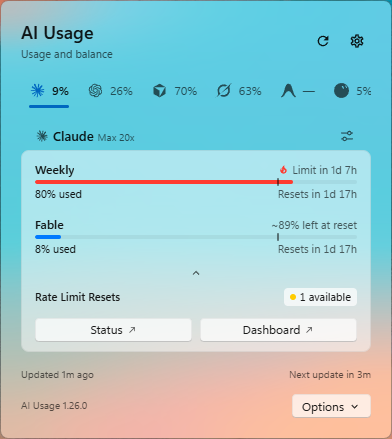 | 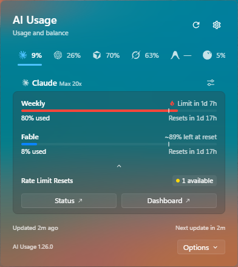 |
| 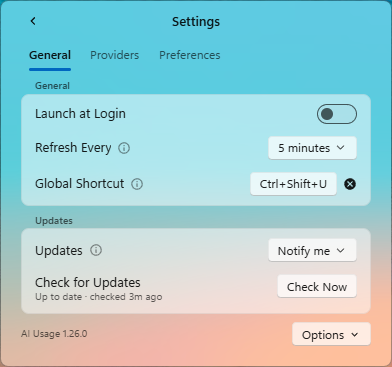 | 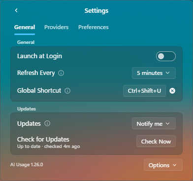 |

| Native in Português | Right-click on the notification-area icon |
|---|---|
| 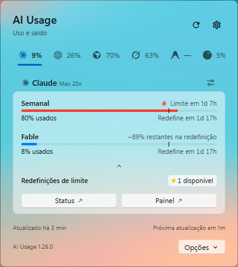 | 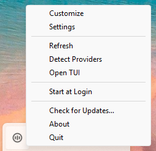 |

Native on macOS 26:

| Light | Dark |
|---|---|
| 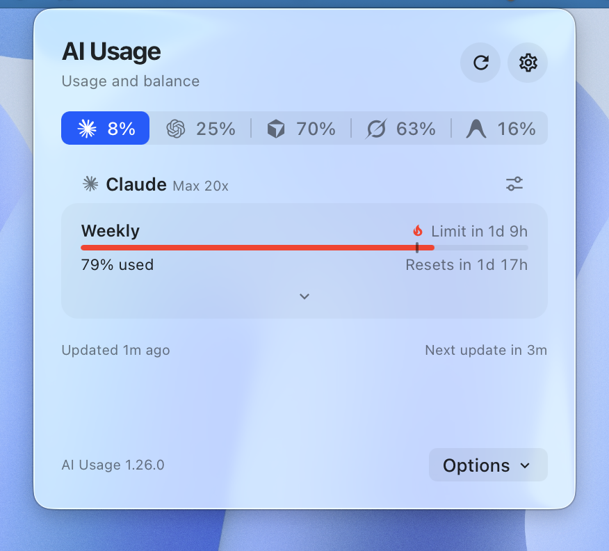 | 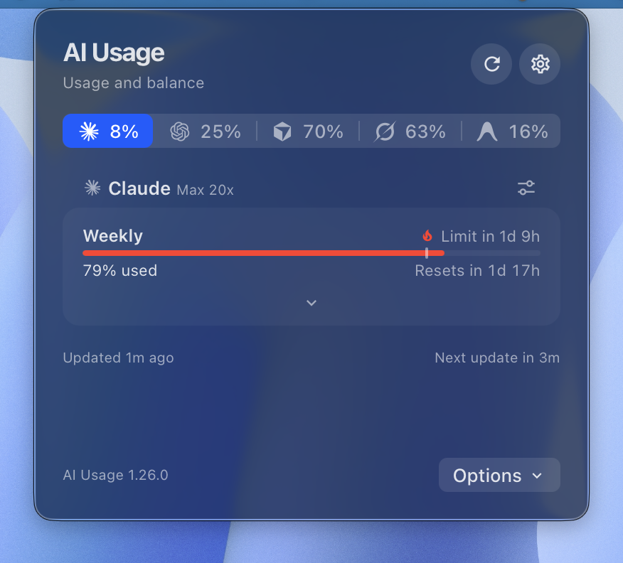 |
| 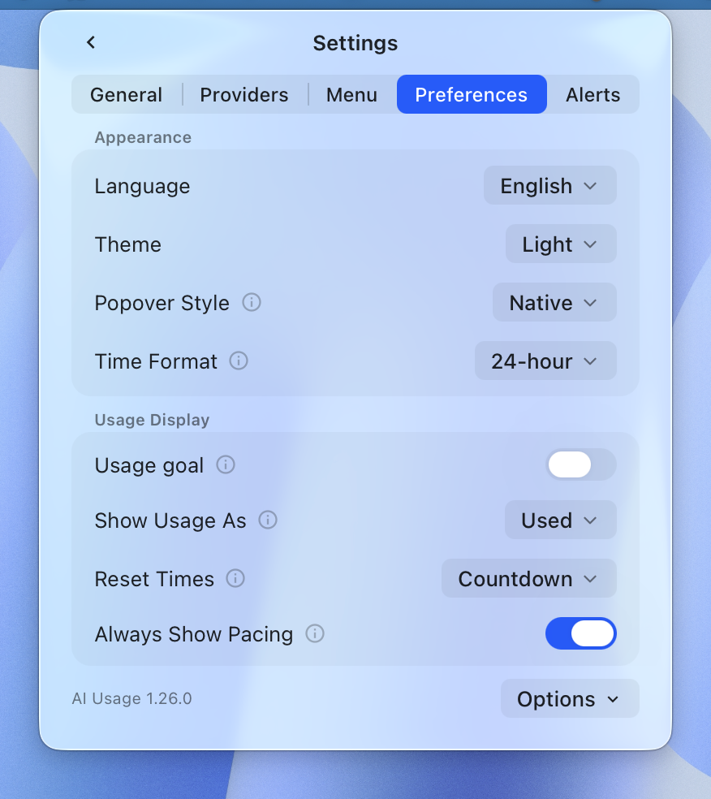 | 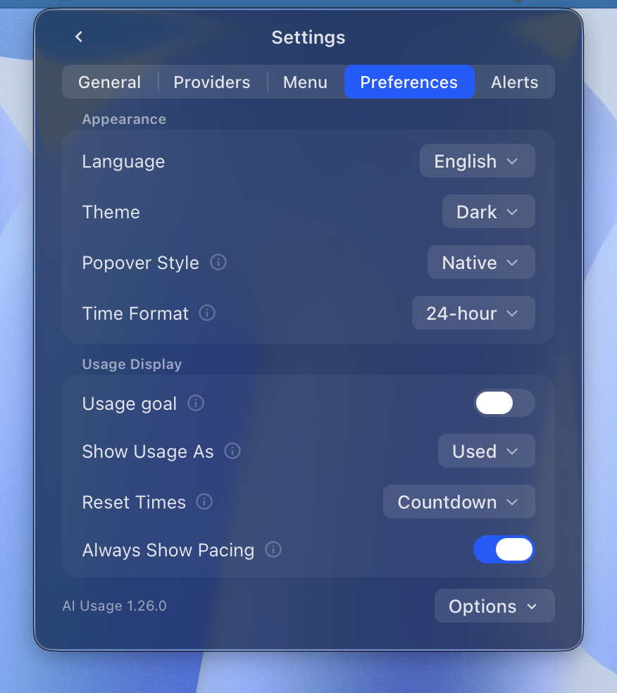 |

| Options menu (Native) | Right-click on the menu bar icon | Classic |
|---|---|---|
| 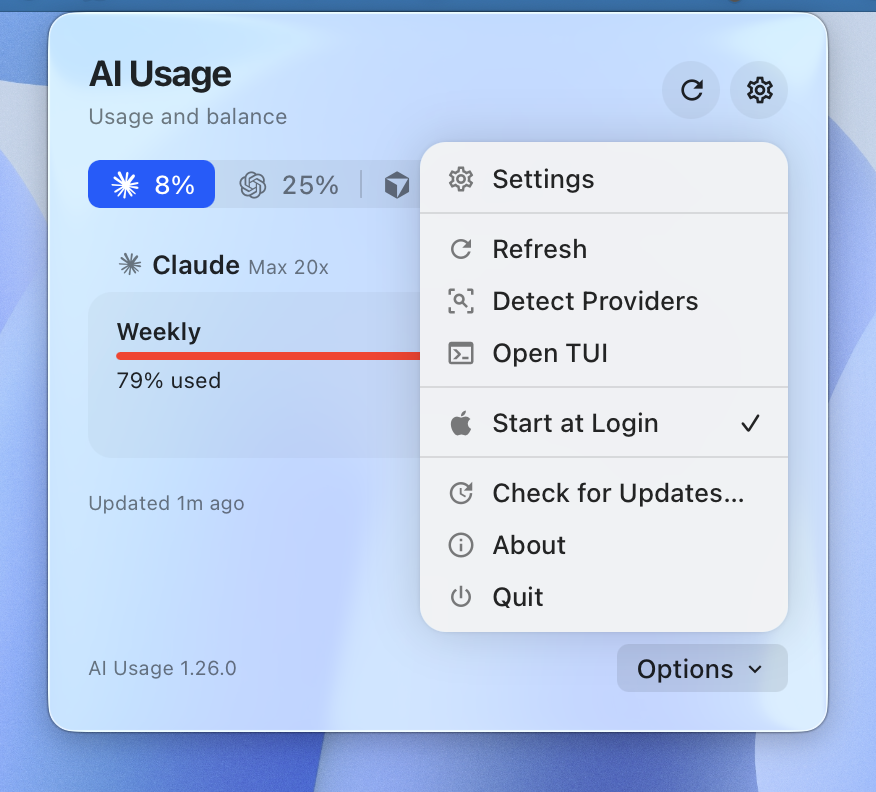 |  | 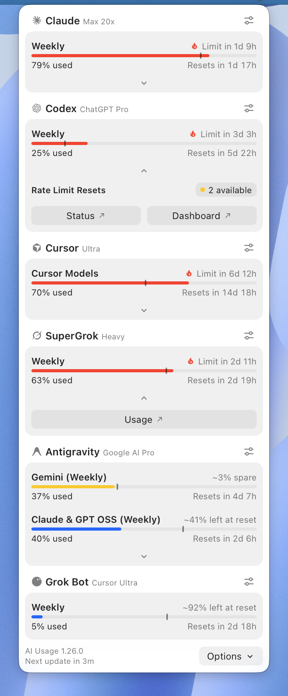 |

When a newer release is out, the dashboard shows it above the provider tabs
(Native) or the cards (Classic), with Install Update where the tray can update
itself:

| Update available (macOS, Native) | Update available (Windows, Native) |
|---|---|
| 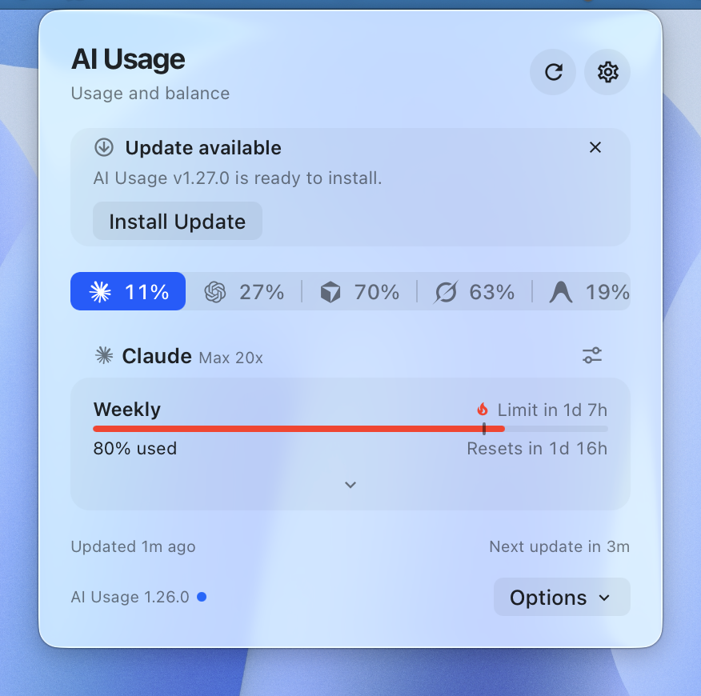 | 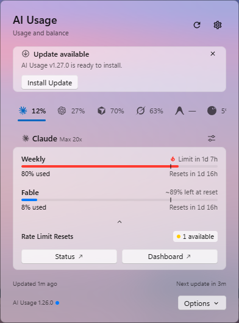 |
| 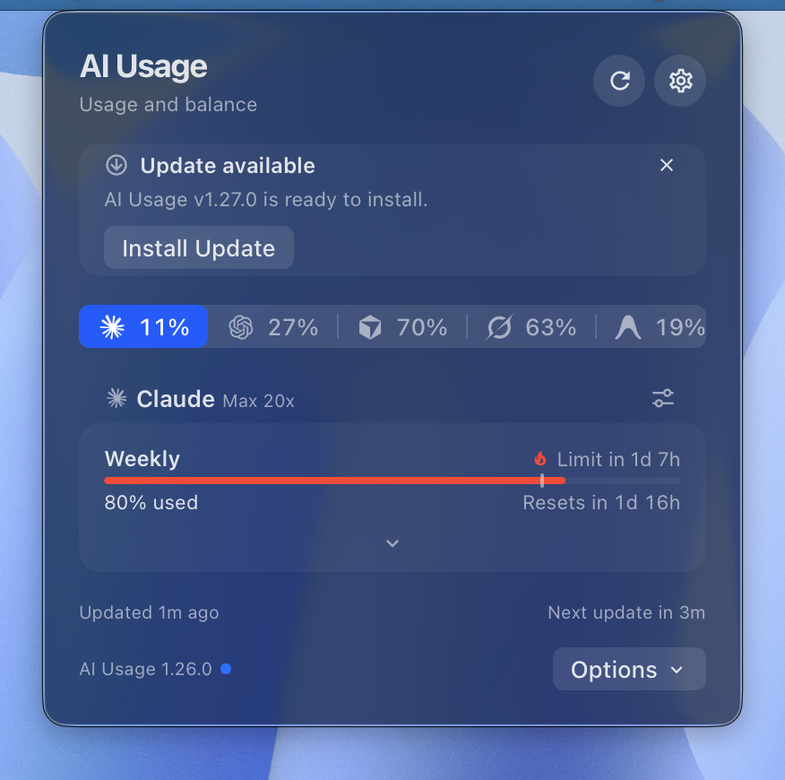 | 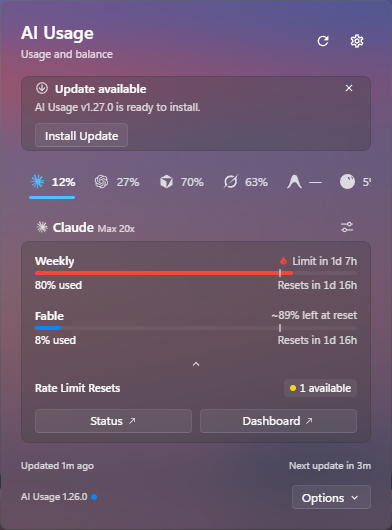 |

On macOS, Chart (default) shows the starred metrics:
 ·
Logos shows one highest-usage percentage per starred provider (lowest remaining
in Left), excluding hidden metrics, just like Quattro's auto window. ·
Quattro: one chip with the selected provider's logo, short name and highest percentage.

### Desktop integrations

| Integration | Supported providers | Notes |
|---|---|---|
| [macOS menu bar](macos/README.md) | Whatever `usage --json` reports | `ai-usagebar-tray`: WKWebView popover + each ready provider's name and usage with a chart glyph. |
| [GNOME Shell](gnome-extension/README.md) | Menu: whatever `usage --json` reports. Top bar: Claude, Codex, Z.AI, OpenRouter, DeepSeek, Antigravity | Usage overview with native provider submenus and configurable appearance; the top bar follows its vendor preference. |
| [KDE Plasma 6](kde-plasmoid/README.md) | Whatever `usage --json` reports | Provider tabs in the popup; vendor is per applet instance. |
| [Linux Mint / Cinnamon](linux-mint/README.md) | Whatever `usage --json` reports | Experimental GTK dashboard with provider icons; left-click the status icon. |
| [Windows tray](windows/README.md) | Whatever `usage --json` reports | NotifyIcon + WebView2 popover; left-click the tray icon. |

The GNOME click menu includes Cursor when enabled in `config.toml`; the
top bar still supports the providers listed in its preferences.

## Community integrations

External projects built on `ai-usagebar usage --json`. They live in their own
repositories and are maintained by their authors, not here.

- [cosmic-applet-ai-usage](https://github.com/jacksonsieben/cosmic-applet-ai-usage)
  — panel applet for the COSMIC desktop.

- [AI Usage for Noctalia](https://github.com/noctalia-dev/community-plugins/tree/main/ai-usagebar)
  — bar widget and panel for the Noctalia v5 shell, installable from its
  plugin browser as `felipeartur/ai-usagebar`.

- [usage for Codex CLI](https://github.com/wellorbetter/ai-usagebar-codex-skill)
  — Codex skill for checking remaining quotas, balances, and reset times with
  `$usage`, using the usage and vendor JSON reports.

## Waybar config

### Single module, scroll-to-cycle (recommended)

Use one bar item and scroll through your vendors. The TUI on-click still shows them all:

```jsonc
"modules-right": ["custom/aibar", ...],

"custom/aibar": {
    "exec": "ai-usagebar --format '{vendor_short} {session_pct}% · {session_reset}'",
    "return-type": "json",
    "interval": 300,
    "signal": 13,
    "tooltip": true,
    "on-click": "ai-usagebar-tui",
    "on-scroll-up":   "ai-usagebar --cycle-next",
    "on-scroll-down": "ai-usagebar --cycle-prev"
}
```

`{vendor_short}` identifies the active provider with a three-letter code. For a
format shared by every cycled provider, use `{session_pct}`,
`{session_reset}`, `{weekly_pct}`, and `{weekly_reset}`. Cursor maps its two
usage pools to the session and weekly slots; Kiro maps its single pool to both.
The [placeholder reference](docs/format-placeholders.md) lists every generic
and provider-specific field.

`signal: 13` lets the scroll commands refresh the bar through `SIGRTMIN+13`
instead of waiting for the next interval.

The [KDE plasmoid](kde-plasmoid/README.md) has the same gesture in its own
settings and never reads or writes the state file this section relies on.

If a tray expander follows `custom/aibar`, the usage text may sit too close to
its icon. Add right padding in Waybar CSS:

```css
#custom-aibar {
    padding-right: 18px;
}
```

### Per-vendor modules

If you'd rather see them all at once:

```jsonc
"modules-right": ["custom/claude", "custom/openai", "custom/openrouter", "custom/zai", "custom/deepseek", "custom/kimi"],

"custom/claude": {
    "exec": "ai-usagebar --vendor anthropic --icon '󰚩'",
    "return-type": "json",
    "interval": 300,
    "tooltip": true,
    "on-click": "ai-usagebar-tui"
},
"custom/openai": {
    "exec": "ai-usagebar --vendor openai --icon '󱢆'",
    "return-type": "json",
    "interval": 300,
    "tooltip": true
},
"custom/openrouter": {
    "exec": "ai-usagebar --vendor openrouter --icon '󱙺' --format '{or_balance} · {or_used_today}'",
    "return-type": "json",
    "interval": 600,
    "tooltip": true
},
"custom/zai": {
    "exec": "ai-usagebar --vendor zai --icon '󰚩'",
    "return-type": "json",
    "interval": 300,
    "tooltip": true
},
"custom/deepseek": {
    "exec": "ai-usagebar --vendor deepseek --icon '󰧑'",
    "return-type": "json",
    "interval": 600,
    "tooltip": true
},
"custom/kimi": {
    "exec": "ai-usagebar --vendor kimi --icon '󰚩'",
    "return-type": "json",
    "interval": 600,
    "tooltip": true
}
```

> Why 300s? The Anthropic and OpenAI Codex endpoints are undocumented and rate-limit aggressively below ~300s. The cache TTL is 60s so multi-monitor instances coexist, but Waybar's polling interval should stay at 300s.

### Multiple Codex accounts

Two ChatGPT subscriptions, each its own login:

```bash
CODEX_HOME=~/.codex-work codex login
```

```toml
[[openai.accounts]]
label = "work"
codex_auth_path = "~/.codex-work/auth.json"
```

```bash
ai-usagebar --vendor openai --account work
```

Each account keeps its own cache and refreshes independently. Without
`--account`, the default `codex_auth_path` login is used exactly as before.

### Multiple Claude accounts

Named accounts appear as separate TUI tabs and report entries. The recommended
setup is:

```bash
ai-usagebar account add work
ai-usagebar --vendor anthropic --account work
```

On macOS, the same account command can also capture and switch the active
Claude Desktop or CLI login. The dedicated
[Claude account guide](docs/claude-accounts.md) covers:

- explicit and auto-discovered accounts;
- safe credential and cache isolation;
- Waybar modules for personal and work subscriptions;
- macOS Desktop and CLI switching, backups, and history conflicts.

### Multiple Antigravity CLI accounts (macOS)

If you keep separate `agy` terminal sessions signed into different Google
accounts, install the official status-line integration once:

```bash
ai-usagebar antigravity setup-statusline
```

Restart existing `agy` terminals or run `/statusline` in them to reload the
configuration. The popover and `ai-usagebar usage --json` then show one entry
per distinct account with a live `agy` process; multiple terminals for the same
account are deduplicated, and the number of entries follows the active
accounts. Names use a masked address such as `j***@gmail.com`.
Public account IDs are opaque and stable on this Mac; sessions remain listed
while `agy` is running, with snapshots marked stale after 15 minutes without a
new status-line payload.

This integration reads only the CLI's status-line payload. It does not read,
copy, or store OAuth tokens, prompts, project paths, or transcripts. When no
valid `agy` status-line snapshot is available, the existing single-account
Antigravity collector remains the fallback. To remove only AI UsageBar's own
status line while preserving other Antigravity settings, run:

```bash
ai-usagebar antigravity remove-statusline
```

This multi-account integration is currently macOS-only.

### Multiple OpenRouter accounts

Add one `[[openrouter.accounts]]` entry per key, then select it with
`--vendor openrouter --account <label>`. Named accounts appear separately in
the TUI, native integrations, and `usage` reports. Each has its own cache, so
one key's fresh data cannot be shown for another. One entry per workspace is
the pattern for several workspaces; keys inside one workspace share its
billing account, so the split is per login session, not per key within a
bill. See the
[OpenRouter account guide](docs/openrouter-accounts.md) for the config and
Waybar examples.

### Multiple keys for other API-key providers

Z.AI, DeepSeek, DeepInfra, Kilo, Novita, Moonshot, Grok, MiniMax, OrcaRouter, and Lyceum take the
same array: one `[[<vendor>.accounts]]` entry per extra key, selected with
`--vendor <vendor> --account <label>`. Region, team, organization, and display
settings stay per provider. See the
[API-key account guide](docs/api-key-accounts.md).

## Hyprland: float the TUI window

By default Hyprland tiles the TUI. To make `ai-usagebar-tui` open as a centered floating window, the same way Omarchy floats its own settings TUIs (Wi-Fi/`impala`, audio/`wiremix`, Bluetooth/`bluetui`), add this to `~/.config/hypr/hyprland.conf` or any sourced `.conf`, such as `looknfeel.conf`:

```ini
# ai-usagebar TUI — float + center + fixed size. omarchy-launch-tui sets the
# app-id from the binary basename, so the class is org.omarchy.ai-usagebar-tui.
# 875x600 matches the size Omarchy gives its own `floating-window`-tagged TUIs.
windowrule = float on, match:class ^(org\.omarchy\.ai-usagebar-tui)$
windowrule = center on, match:class ^(org\.omarchy\.ai-usagebar-tui)$
windowrule = size 875 600, match:class ^(org\.omarchy\.ai-usagebar-tui)$
```

Then `hyprctl reload` (no logout needed).

> Omarchy tags a hardcoded list of TUI app-ids with `floating-window` in `~/.local/share/omarchy/default/hypr/apps/system.conf`, which then applies `float + center + size 875 600`. The rules above set those values directly, so the size is deterministic regardless of which config is sourced first. If you launch the TUI differently (e.g. `kitty -e ai-usagebar-tui`), replace the class regex with whatever `hyprctl clients` reports for your terminal.

> Hyprland 0.46+ uses the unified `windowrule` keyword with `match:…` filters.
> The older `windowrulev2 = …, class:…` syntax still works on legacy releases
> but is deprecated. Use the form above on current Omarchy and Hyprland.

## Provider coverage

The CLI and TUI support every provider in the authentication table above.
Native desktop coverage varies by integration. The
[provider endpoint reference](docs/vendor-endpoints.md) lists each endpoint,
reported metric, desktop selector, stability note, and live-test command.

Run `make smoke` to check live response shapes.

For Ollama Cloud setup (Bearer key from ollama.com/settings/keys), see the
[Ollama integration guide](docs/ollama-setup.md).

ShvIA is a self-hosted, OpenAI-compatible gateway: set `SHVIA_API_KEY` (or an
inline `[shvia] api_key`) and, unless you are on the default deployment, point
`[shvia] base_url` at your own. See
[configuration](docs/configuration.md#shvia-self-hosted-gateway).

## Format placeholders

Use placeholders in `--format` and `--tooltip-format`:

```bash
ai-usagebar --vendor anthropic --format '{session_pct}% · {session_reset}'
ai-usagebar --vendor openrouter --format '${or_balance} remaining'
```

Shared claudebar placeholders and every provider-specific field are listed in
the [format placeholder reference](docs/format-placeholders.md).

## Contributing

See [CONTRIBUTING.md](CONTRIBUTING.md) for the pre-PR gate, the checklist,
and the bar a new provider has to clear.

## Local development

```bash
ai-usagebar --watch 5                              # iterate on --format live
ai-usagebar --vendor openrouter --format '{or_balance} · today {or_used_today}'

make test                                          # unit + integration
source ~/.config/zsh/secrets                       # required for existing vendor smoke tests
make smoke                                         # runs all ignored tests; only Kimi skips without its key
make clippy                                        # cargo clippy -D warnings
```

## TUI controls


- `↑` / `↓` — move through the vendor menu (wraps; `Tab`/`l`/`→` and
  `Shift+Tab`/`h`/`←` still work as secondary shortcuts)
- Mouse — click a vendor menu entry to select it; click the footer's
  `r`/`R`/`s`/`q`/`Esc` actions to refresh, refresh all, open Settings, or
  quit; in Settings, click a field to focus it or click **Save** to save
- `r` — refresh active tab
- `R` — refresh all tabs
- `s` — open Settings overlay (primary vendor + API keys)
- `c` — open local Claude context sessions (only when `[context] enabled = true`); `v` cycles its layout
- `q` / `Esc` / `Ctrl-C` — quit

The TUI refreshes every 60 seconds. During a refresh it keeps the current values
visible with a `↻` marker. If the request fails, the last snapshot remains on
screen and is marked stale.

OpenRouter uses the same layout for balance, usage by period, and account tier:


### Local context overlay

The optional context overlay answers a different local question from the
vendor tabs: how much input context was present in recent Claude Code sessions.
Enable it by hand, restart the TUI, and press `c`:

```toml
[context]
enabled = true
layout = "full"                          # full | split | bottom  (`v` cycles)
# projects_path = "~/.claude/projects"  # this is the default
# context_window_tokens = 200000         # optional fallback

# Exact model ids override the fallback when 200K and 1M sessions coexist.
[context.model_context_window_tokens]
"claude-opus-4-6" = 1000000
```

The default `full` layout replaces the dashboard body. Press `v` to cycle
through `full`, `split`, and `bottom` layouts.

- `↑`/`↓` or `j`/`k` selects a session.
- `Enter` opens its detail gauge.
- `Esc` returns and `r` rescans.

The percentage follows
[Claude Code's status-line definition](https://code.claude.com/docs/en/statusline):
`input_tokens + cache_creation_input_tokens + cache_read_input_tokens`. Without
a trustworthy model window size, the overlay shows tokens instead of guessing
a percentage. After compaction, it waits for the next assistant response before
calculating a new value.

The reader handles Claude Code's undocumented local JSONL defensively:

- it reads bounded tails from the 100 most recently modified top-level
  sessions;
- it ignores corrupt records and `subagents` sidechains;
- it does not follow discovered symlinks;
- it performs filesystem work off the UI thread.

While enabled, `usage` (and every panel built on `usage --json`) also says
what each Claude account's live sessions are doing: an `Activity` row such as
`2 working · 1 waiting`, read from the `sessions/` directory Claude Code keeps
in that account's config directory — the directory of the credentials file its
quota is fetched from, so `~/.claude` by default, and `~/.claude` too for an
account `account switch` made the live login. The default entry follows
`credentials_path`, not the `CLAUDE_CONFIG_DIR` of the shell that runs
`usage`; give another directory its own account to see its sessions.

Those files outlive a crashed Claude Code, so a session counts only while a
process with its pid is running — on Linux, the process that started when the
file says it did, which also rules out a recycled pid. A file written on
another operating system (a config directory shared across a dual boot) never
counts. Agent SDK runs (`entrypoint: "sdk-cli"`, as `claude -p` and background
agents write) are not counted, and the files are only ever read.

When the feature is disabled, nothing under `~/.claude/projects` is read and
`usage` reads no `sessions/` directory. The Waybar widget's Claude tooltip is
separate and always on: it shows the same `2 working · 1 waiting` line for the
account the module displays, read the same way from the directory beside that
module's credentials. A Claude Desktop profile (`--desktop`) has no such
directory and shows no line. Context options remain in TOML
rather than the Settings modal.

### Settings overlay


Press `s` while the TUI is open. The overlay lets you:

- Pick the **primary vendor** that the widget defaults to and that the TUI selects on startup. Use `←` / `→` to cycle.
- Enter a key for any supported API-key provider. Keys are masked as you type;
  press `Ctrl-V` to reveal or hide them. The provider's configured environment
  variable still wins at runtime; the inline key is the fallback. Saving a
  non-empty key also sets that provider's `enabled = true`.

Key bindings inside the overlay:

- `Tab` / `↑↓` — move between fields
- `←` / `→` — cycle primary-vendor selection (only on the vendor field)
- `Ctrl-V` — toggle key visibility on the focused key field
- `Ctrl-S` — save and close
- `Esc` — discard and close

Save updates `~/.config/ai-usagebar/config.toml` through `toml_edit`, preserving
comments and unrelated settings. The file is set to mode `600`.

Omarchy's native QML form uses the same Rust persistence path and semantics.
It never loads stored key values into the long-lived shell process: blank means
unchanged, clear is explicit, and new values are sent to the binary over stdin.

After saving:

- TUI tabs fetch again immediately.
- Waybar modules configured with `signal: 13` refresh through `SIGRTMIN+13`.
- Other Waybar modules refresh on their next interval. Run
  `pkill -SIGUSR2 waybar` to force a full reload.

## Theming

- One Dark palette by default.
- Auto-merges with the active Omarchy theme at `~/.local/state/omarchy/current/theme/colors.toml` (the older `~/.config/omarchy/current/theme/colors.toml` location is still read when that file is absent).
- Per-color overrides: `--color-low`, `--color-mid`, `--color-high`, `--color-critical` (claudebar-compatible).

## Changelog

See [CHANGELOG.md](CHANGELOG.md) for the release history. Each release also has its own page at <https://github.com/akitaonrails/ai-usagebar/releases> with the auto-generated install snippet and checksum.

## Acknowledgements

The Codex and Claude OAuth endpoint references came from
[`claudebar`](https://github.com/mryll/claudebar) and
[`codexbar`](https://github.com/mryll/codexbar), both by mryll. The bordered
Pango tooltip, severity colors, and pacing math also come from those projects.

The Kimi `/coding/v1/usages` endpoint reference came from community quota tools: [`CodexBar`](https://github.com/steipete/CodexBar) (steipete), [`OpenUsage`](https://github.com/robinebers/openusage), and [`OmniRoute`](https://github.com/diegosouzapw/OmniRoute).

## License

MIT.
